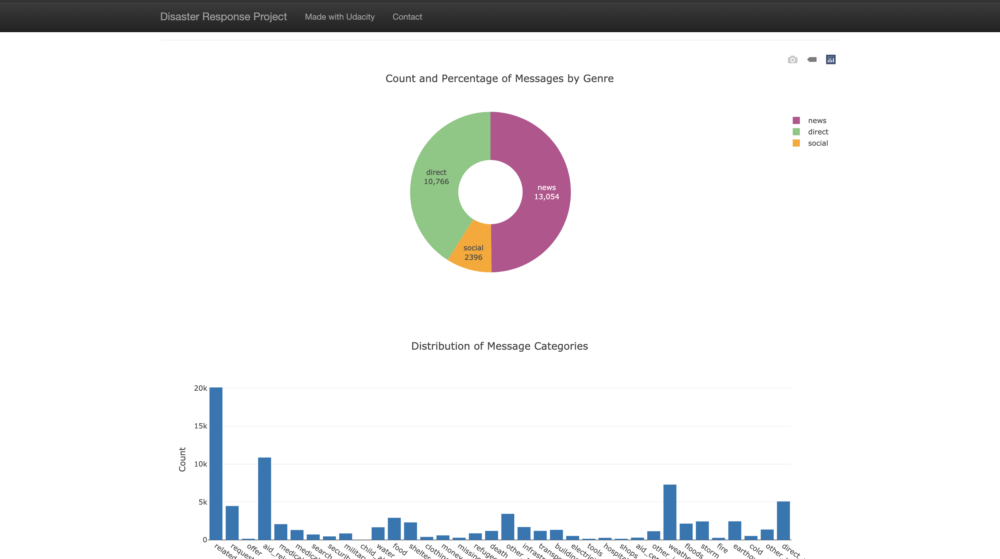
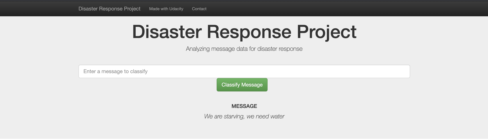
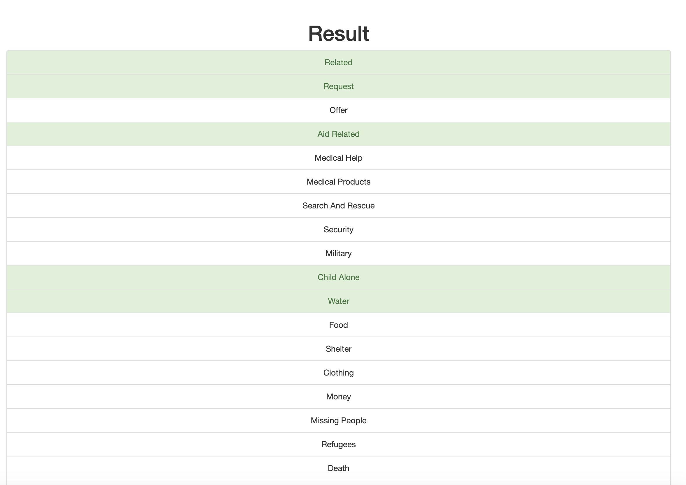
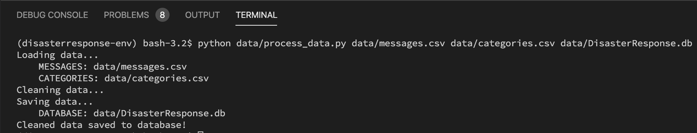
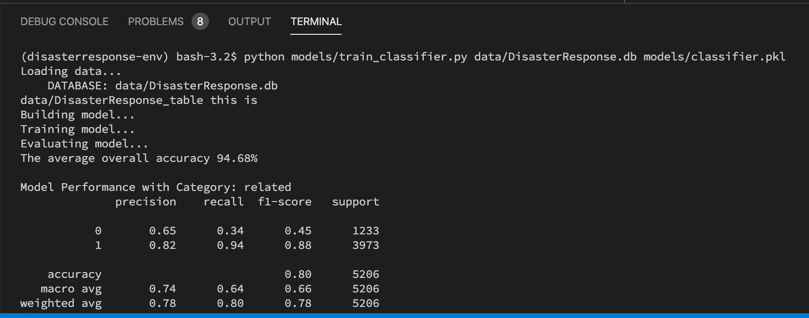

# Disaster Response Pipeline

This Project is part of Data Science Nanodegree Program by Udacity in collaboration with Figure Eight. The dataset contains pre-labelled tweet and messages from real-life disaster events. The project is designed to initiate a web app which an emergency operators could utilize during a disaster to classify disaster messages into several categories that is relevant to those messages which can further be forwarded to the responsible entities for immediate attention.

## Description:
* **data/process_data.py**: This python excutuble code contains the Extract Train Load (ETL) pipeline used for data cleaning, feature extraction, and storing data in a SQLite database

* **model/train_classifier.py**: This python excutuble code contains a machine learning pipeline that loads data from SQLite database, trains a model, and saves the trained model as a pickled file(.pkl file) for future use.

* **data/ETL Pipeline Preparation.ipynb**:  An interactive environment for the data/process_data.py development process

* **models/ML Pipeline Preparation.ipynb**: An interactive environment for the model/train_classifier.py. development process

* **data**: This folder contains diaster messages and categories datasets in CSV format.

* **app**: This folder contains the run.py to initiate the web application and the templates folder responsible for the User interface.

### Instructions to run the app on your local computer:
1. Run the following commands in the project's root directory to set up your database and model.

    - To run ETL pipeline that cleans data and stores in database
        `python data/process_data.py data/messages.csv data/categories.csv data/DisasterResponse.db`
    - To run ML pipeline that trains classifier and saves
        `python models/train_classifier.py data/DisasterResponse.db models/classifier.pkl`

2. Prepare your shell to run the flask app on development environment
    `export Flask_ENV=development`

3. Run the following command in the app's directory to run your web app.
    `python run.py`

4. Go to your browser and run `http://0.0.0.0:5000/` to access the web app

## Screenshots

***Screenshot 1: App analysis of the data base***

***Screenshot 2: App word search section***

***Screenshot 3: App search result section***

***Screenshot 4: ETL pipeline***

***Screenshot 4: ETL pipeline***

## License

## Acknowledgements

* [Udacity](https://www.udacity.com/): Data Science program initiative and support
* [Figure Eight](https://www.figure-eight.com/): Data source

## Author

* [Akande Imisioluwa](https://github.com/imisi-akande)

